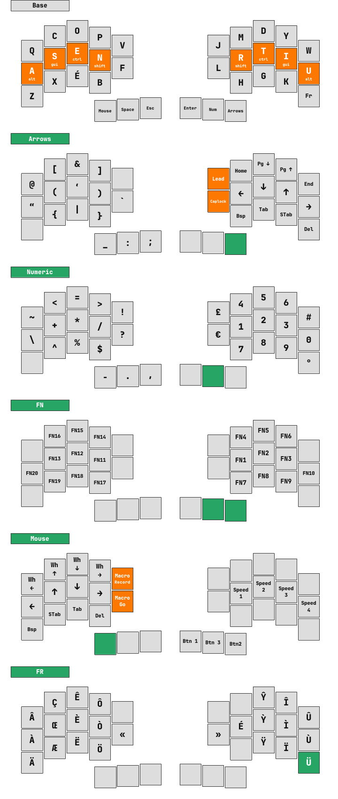
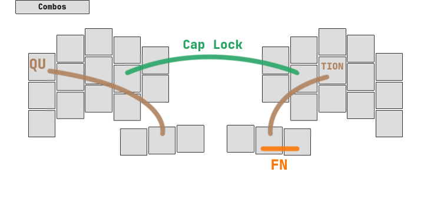

<div align="center">
    
</div>

This is the rustenuine firmware for the [Chew](https://github.com/flinguenheld/chew) keyboard!

It performs some cool hacks that keyboard enthusiasts love:

- Layers
    - Set default
    - Activated as long as a key is held down ❤️
    - Dead key style (activated until another key is pressed or as long as being held)
- Homerows
    - Hold down to activate a modifier
    - Press to print a regular key
- Combos
    - Two keys pressed at once result in a third one
- Leader key
    - Once activated, it allows you to hit a sequence (3 keys max) to produce another key
    - Leave it with Escape or a wrong key
- Mouse emulation
- LED
    - Synchronise the embedded controler's aRGB LED (e.g. for layers, caplock...)
- Buzzer
    - Buzz jingles (and do it in stereo with the split version!)
- No mods
    - Prevent modifiers with specific keys (e.g. no shifted symbols)
- Caplock
    - Deactivated by itself or Escape
- Macros
    - One key can produce a chain of keys (e.g. to automate accents or email addresses)
- Dynamic macros
    - Record
        - Press `KC::DynMacRecord`
        - Then another key which will be used to create an entry in the macro dictionary
        - Now all pressed key are recorded with its modifiers
        - Press `KC::DynMacRecord` again to end up the record
    - Launch
        - Press `KC::DynMacGo`
        - Then the key which was used to record the macro

<div align="center">
    
</div>

### Layout

Here's my *current* layout which uses the US international extended keymap.  
The letter positions come from [Ergo-L](https://ergol.org/) which is my favourite French layout.

<div align="center">
    
</div>

<div align="center">
    

#### Leader-key

| Combination | Printed |
| :---------: | :-----: |
| F + L       | flinguenheld |
| M + A       | florent@linguenheld.net |
| M + S       | f@linguenheld.net |
| H + T       | https:// |
| D + O + T   | https://github.com/flinguenheld/dotfiles |
| N + I + X   | sudo nixos-rebuild switch --flake .#flopc |
|             |   |
| D + I + A   | ø |
| D + E + G   | ° |
| C + O + P   | © |
| R + E + G   | ® |
| B + E + T   | ß |
| P + I + L   | ¶ |
|             |   |
| M + U + L   | × |
| D + I + V   | ÷ |
| E + X + 1   | ¹ |
| E + X + 2   | ² |
| E + X + 3   | ³ |
|             |   |
| 1 + 4       | ¼ |
| 1 + 2       | ½ |
| 3 + 4       | ¾ |

</div>

<div align="center" style="margin-top: 20px;">
    
</div>

### Flash

Clone this repo:

```
  git clone https://github.com/flinguenheld/rustychew
```

Then, hold down the controller's **boot** button and plug in the usb cable.  
Mount the controller's drive and use one of these commands:  

> 💡 Use the feature "zero" to flash the RP2040-zero (its led is wired GRB).

##### Mono
```
  cargo run --release --bin mono
  cargo run --release --bin mono --features zero
```

##### Split with the [0xCB-Gemini](https://github.com/0xCB-dev/0xCB-Gemini) controller

>This controller has a vbus detection that allows the keyboard to know which side is
>connected to the computer.  
>Therefore once you have flashed both sides with the split command, you'll be able to use any of them as master.
```
  cargo run --release --bin split
```

##### Split with the [RP2040-Zéro](https://www.waveshare.com/wiki/RP2040-Zero) controller

>For this one, the position of the master is fixed, you have to make your choice and flash both side with one of these commands:

```
  cargo run --release --bin split --features master,zero
```
```
  cargo run --release --bin split --features slave,zero
```

##### Serial

To do some tests and print text throught the [usb port](https://github.com/rust-embedded-community/usbd-serial), you can compile with the feature `serial`:  
Then check the usb events to know which tty is used.  
```
    sudo udevadm monitor
```

And connect to it (for instance with minicom or picocom. *Ctrl-A X to exit* )
```
    sudo minicom --device /dev/ttyACM0
    sudo picocom /dev/ttyACM0 -b 115200
```

<div align="center">
    
</div>

### Thanks

Rusty Chew uses the [usbd-human-interface-device](https://github.com/dlkj/usbd-human-interface-device) crate which simplifies
the usb management ❤️.  
Also the [pio-uart](https://github.com/Sympatron/pio-uart) which allowed me to create a UART half-duplex protocol.  
And the [rp-hal-boards](https://github.com/rp-rs/rp-hal-boards) that I used as a base to use the RP2040-zero controller.  

<div align="center">
    
</div>
