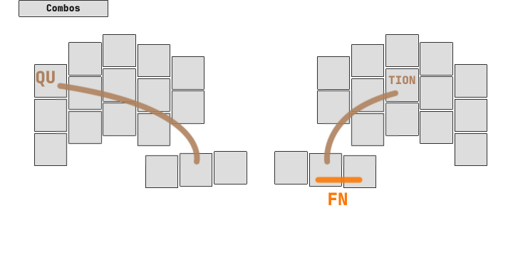
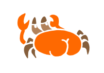

<div align="center">
    
</div>

This is the rustynuine firmware for the [Chew](https://github.com/flinguenheld/chew) keyboard!

It performs some cool hacks that all keyboard enthousiats love:

- Layers (momentary & dead)
- Homerows (Hold to activate a modifier, Press to print a regular key)
- Combos (two keys pressed at once result in a third one)
- Leader key (Once activated, it allows you to hit a sequence (3 keys max) to produce another key (leave it with Escape or a wrong key))
- Macros (One key can produce a chain of keys (e.g. to automate accents or email addresses))
- Mouse emulation
- Caplock (Deactivated by itself or Escape)

<div align="center">
    
</div>

### Layout

Here's my *current* layout which is based on the French layout named [Ergo-l](https://ergol.org/) and uses the
US international extended keymap.

<div align="center">
    
</div>

<div align="center">
    
</div>

<div align="center">
    
</div>

### Install

Clone this repo:

```
  git clone https://github.com/flinguenheld/rusty_chew
```

Then, hold down the controller's **boot** button and plug in the usb cable.  
Mount the controller's drive and use one of these commands:

```
  cargo run --release --bin left
```
```
  cargo run --release --bin right
```
```
  cargo run --release --bin mono
```

*The split version only works with the usb cable connected to the left part.*
<div align="center">
    
</div>

### Thanks

Rusty Chew uses the [usbd-human-interface-device](https://github.com/dlkj/usbd-human-interface-device) crate which simplifies
**a lot** the usb management ❤️.  
Also the [pio-uart](https://github.com/Sympatron/pio-uart) which allowed me to create a uart half-duplex protocol.  
And the [rp-hal-boards](https://github.com/rp-rs/rp-hal-boards) as a base to use the rp2040-zero board.  

<div align="center">
    
</div>
